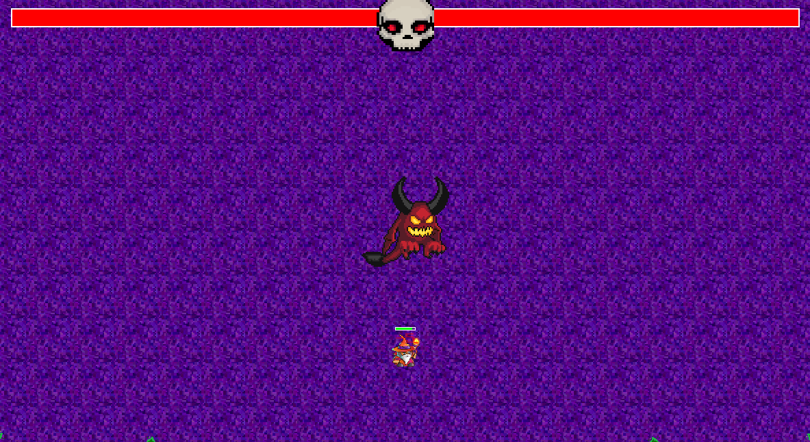

# Realm of the Mad Game (RotMG) – Pygame Edition

A fast-paced 2D action shooter inspired by *Realm of the Mad God*, created using **Python** and **Pygame**. Battle waves of enemies, dodge projectiles, and defeat the final boss to win!

---

## 🎮 Gameplay Features

- **Top-down bullet hell combat**
- **Player animations** (idle, movement, shooting)
- **Enemy AI** and projectile mechanics
- **Boss fight** with multiple attack patterns and charge phases
- **Floating damage numbers**
- **Portal system** to enter the boss room
- **Boss phase change mechanics**
- **Hazards** (slowing, damaging goo below 50% boss HP)
- **Game Over** and **Game Win** screens with restart functionality

---

## 📸 Screenshots

| Combat | Boss Fight | Game Win |
|--------|------------|----------|
|  |  |  |

---

## 🚀 Controls

| Key | Action |
|-----|--------|
| `WASD` | Move |
| `Mouse` | Aim |
| `Left Click` | Shoot |
| `Space` | Enter portal |
| `R` | Restart (on Game Over / Win screen) |
| `Esc` | Quit |

---

## 🎥 Gameplay Preview (WebM)

▶️ [Watch gameplay](https://imgur.com/a/rCwHDYg)

---

## 🧰 Requirements

- Python 3.9+
- pygame

### Install dependencies:
pip install pygame

---

## ▶️ Running the Game
python main.py

---

## 🏆 Credits

- Inspired by Realm of the Mad God
- Developed by [Your Name Here]
- Graphics & music are placeholders and for educational/demo purposes only
